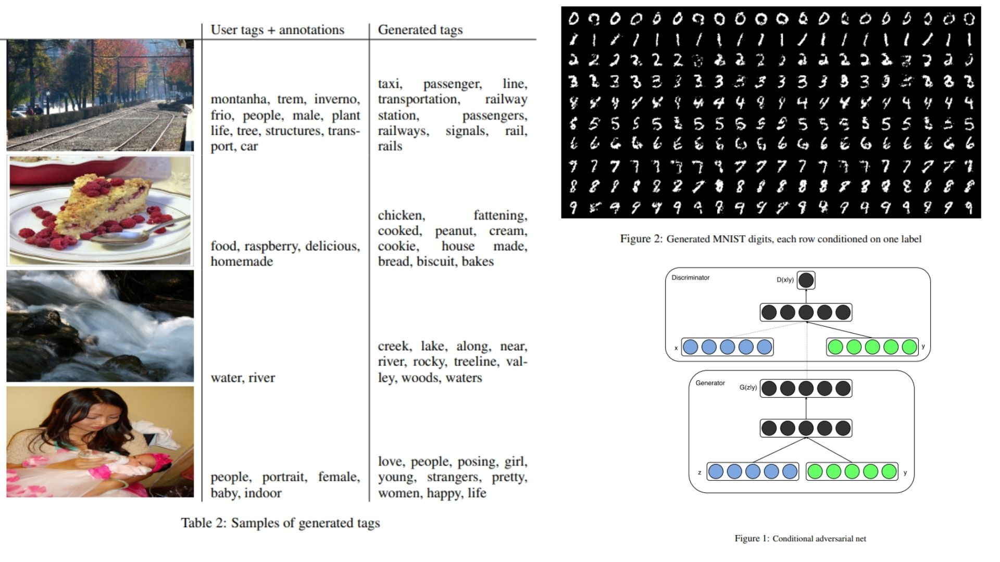

# 🌑 cGAN-Replication — Conditional Generative Adversarial Nets

This repository provides a **faithful Python replication** of the **Conditional Generative Adversarial Networks (cGAN) framework** for conditional data generation.  The code implements the pipeline described in the original paper, including **conditional generation, adversarial training, and minimax loss computation**.

Paper reference: *[Conditional Generative Adversarial Nets](https://arxiv.org/abs/1411.1784)*  

---

## Overview 🌈



> The pipeline generates data conditioned on auxiliary information \(y\), using a **generator** that maps noise \(z\) and labels \(y\) to synthetic samples, and a **discriminator** that evaluates real vs generated data conditioned on \(y\).

Key points:

* **Generator \(G\)**: maps \((z, y)\) to $$(x_\text{hat}\)$$  
* **Discriminator \(D\)**: predicts probability that input \(x\) is real given \(y\)  
* **Conditional input**: labels \(y\) guide generation towards specific modes  
* **Adversarial training**: min-max game ensures \(G\) produces realistic samples  
* **Loss**:  

$$
\min_G \max_D V(D,G) = \mathbb{E}_{x \sim p_\text{data}(x)}[\log D(x|y)] + \mathbb{E}_{z \sim p_z(z)}[\log (1 - D(G(z|y)))]
$$

---

## Core Math 📐

**Generator mapping**:

$$
x_\text{hat} = G(z|y)
$$

**Discriminator probability**:

$$
D(x|y) = \text{Pr}(x \text{ is real } | y)
$$

**Conditional concatenation**:

$$
[z, y] \to G, \quad [x, y] \to D
$$

**Adversarial min-max loss**:

$$
\mathcal{L}_{GAN} = \mathbb{E}_{x \sim p_\text{data}}[\log D(x|y)] + \mathbb{E}_{z \sim p_z}[\log(1 - D(G(z|y)))]
$$

---

## Why cGAN Matters 🌿

* Generates **data conditioned on labels or auxiliary information** 🎯  
* Allows **mode-specific generation**, controlling outputs instead of random sampling  
* Supports **multimodal learning**, e.g., image-to-tag or image-to-class tasks 🧩  

---

## Repository Structure 🏗️

```bash
cGAN-Replication/
├── src/
│   ├── generator/
│   │   └── g_mlp.py                  # Generator: z + y → x_hat (MLP blocks)
│   │
│   ├── discriminator/
│   │   └── d_mlp.py                  # Discriminator: x + y → probability
│   │
│   ├── layers/
│   │   ├── concat_input.py           # Concatenate z+y for G, x+y for D
│   │   └── embedding.py              # Optional label embedding for categorical y
│   │
│   ├── loss/
│   │   └── gan_loss.py               # Minimax loss: log D(x|y) + log(1-D(G(z|y)))
│   │
│   ├── model/
│   │   └── cgan_model.py             # Full pipeline: Generator + Discriminator, training loop
│   │
│   └── config.py                     # Hyperparameters, device, noise dimension, hidden dims
│
├── images/
│   └── figmix.jpg                   
│
├── requirements.txt
└── README.md
```

---

## 🔗 Feedback

For questions or feedback, contact:  
[barkin.adiguzel@gmail.com](mailto:barkin.adiguzel@gmail.com)
